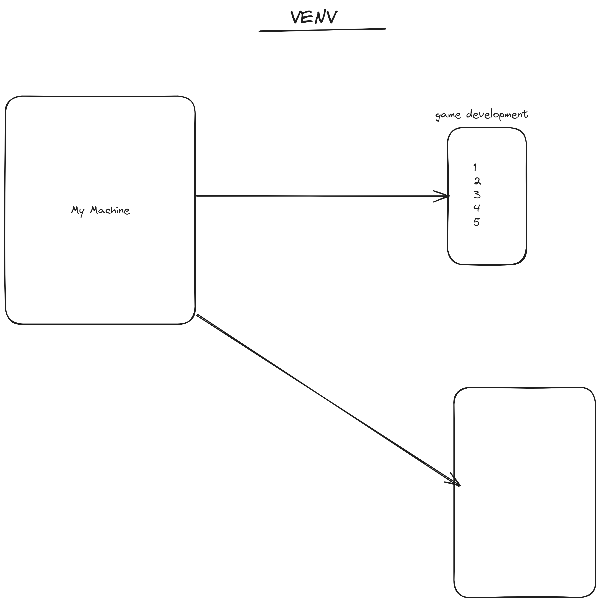

## Python Virtual Environment

Creating a venv

```console
python -m venv venv_name
```



If you want to see in the live then click drow here button

#### [Drow here](https://excalidraw.com/#json=8bGvemgz2k7nNfDz73TsW,bJbSkKTGoD4gm0TToHMBEw)
